# PYTHON


## REFERENCE

[Python 文档](https://docs.python.org/zh-cn/3/index.html#)

[Python 语言参考](https://docs.python.org/zh-cn/3/reference/index.html)

[Python 标准库](https://docs.python.org/zh-cn/3/library/index.html)

[术语对照表](https://docs.python.org/zh-cn/3/glossary.html#term-generator)

---

[w3cschool_python](https://www.w3cschool.cn/python3/)

[runoob_python](http://www.runoob.com/python3/python3-tutorial.html)

[tutorialsPoint_python](https://www.tutorialspoint.com/python/)

[Python Frequently Asked Questions](https://yiyibooks.cn/xx/python_352/faq/index.html)

[python开发大全、系列文章、精品教程](https://blog.csdn.net/luanpeng825485697/article/details/78347433)

[pywin32](http://timgolden.me.uk/pywin32-docs/contents.html)

[python code example](https://www.programcreek.com/python/)

[Python Extension Packages](https://www.lfd.uci.edu/~gohlke/pythonlibs/)

[python other Libs](https://www.lfd.uci.edu/~gohlke/pythonlibs/)

[python 库大全](https://blog.csdn.net/yang889999888/article/details/73836954)


## INSTALL & CONFIG


### PIP


[pip command](https://www.runoob.com/w3cnote/python-pip-install-usage.html)

[pip document](https://pip.pypa.io/en/stable/)


#### 修改源

https://blog.csdn.net/sinat_21591675/article/details/82770360


### Jupyter Notebook

ref:

https://www.cnblogs.com/nxld/p/6566380.html)

https://blog.csdn.net/u013084616/article/details/79126585

https://blog.csdn.net/create115721/article/details/79243641

[快捷键](https://blog.csdn.net/qq_38640439/article/details/81143836)

[快捷键2](https://blog.csdn.net/HeatDeath/article/details/78030902)


#### install

install:  `pip install jupyter`

run: `jupyter notebook`

自动跳转到网页界面:

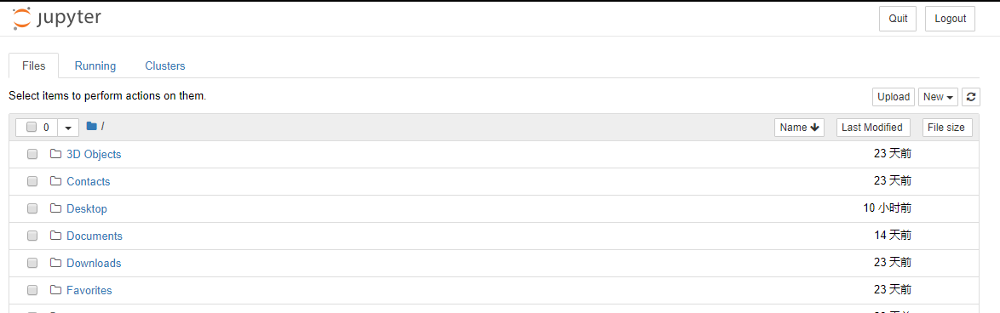


#### theme

https://blog.csdn.net/Jinlong_Xu/article/details/79221943

https://blog.csdn.net/bryant_meng/article/details/78609948

[jupyter extensions](https://www.jianshu.com/p/548b893e0b73)


### PyCharm


#### theme

http://www.themesmap.com/


import:

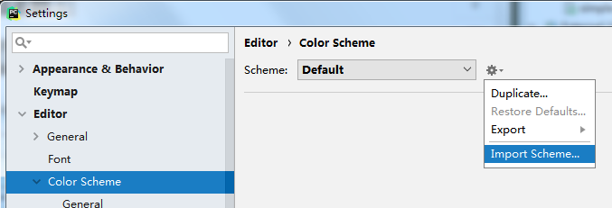


#### config


##### pyqt5 setting

setting > tools > external tools

- QtDesigner

    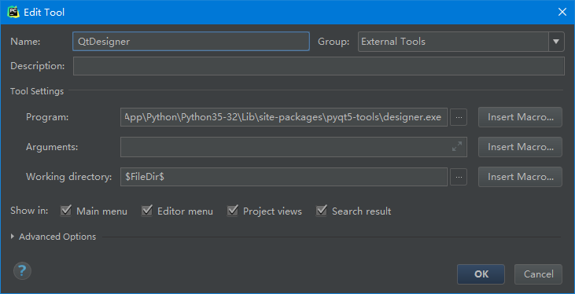

- PyUIC

    > covert ui to py file.

    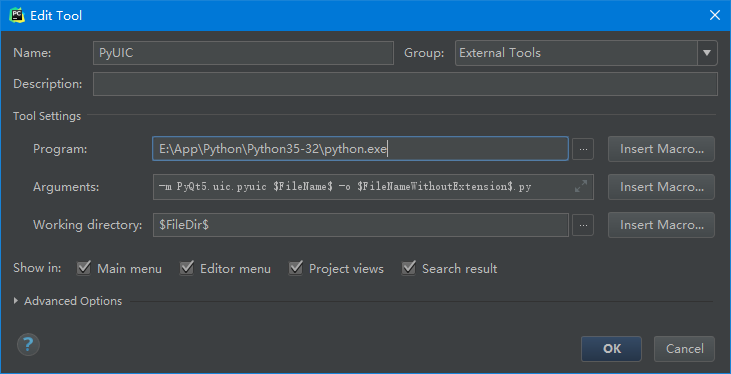

    arguments:

    `-m PyQt5.uic.pyuic $FileName$ -o $FileNameWithoutExtension$.py`

- OpenUifileWithDesigner

    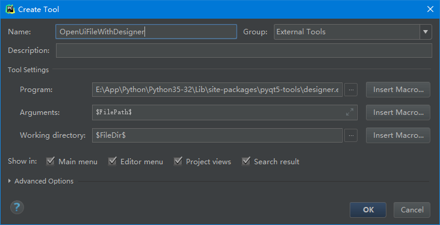

    

##### 鼠标悬停快速提示方法参数

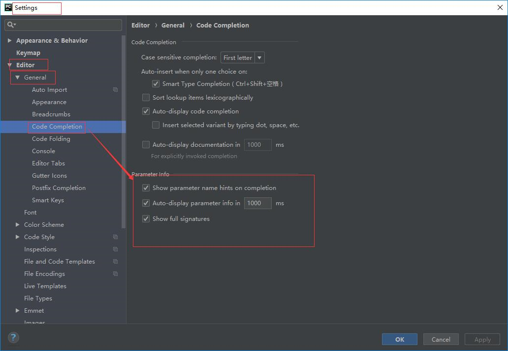

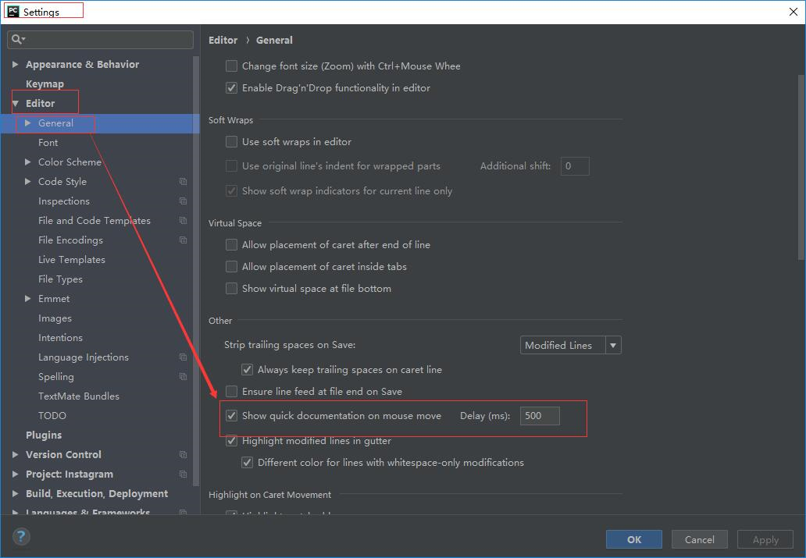


##### tab 代码块

https://www.cnblogs.com/andy9468/p/8988501.html

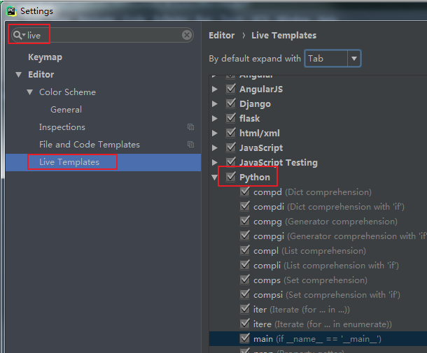


参数:

`$ITERABLE$`    表示光标初始停留的位置

`$end$`        表示光标中途停留的位置

`$END$`       表示光标最后停留的位置（tab切换）

`$SELECTION$`   表示被选中的代码

`$class$`       表示当前所在类名

`$method$`    表示当前所在方法名

`$NAME$`     名称位置标记（自定义），初始光标停留。一般多个$NAME$，用于同时命名。

`$var$`        变量位置标记（自定义），初始光标停留。一般多个$var$，用于同时命名。

``$var1$`       变量1，tab切换时，光标会在该处停留

``$var2$`       变量2，tab切换时，光标会在该处停留

`$var3$`       变量3，tab切换时，光标会在该处停留


##### 输出中文乱码

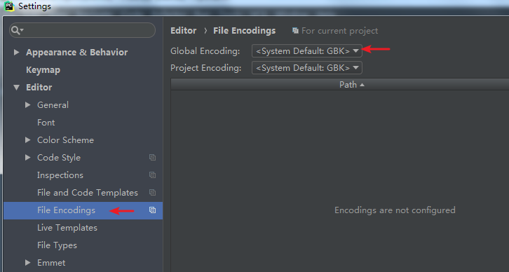


##### 加上头行 coding

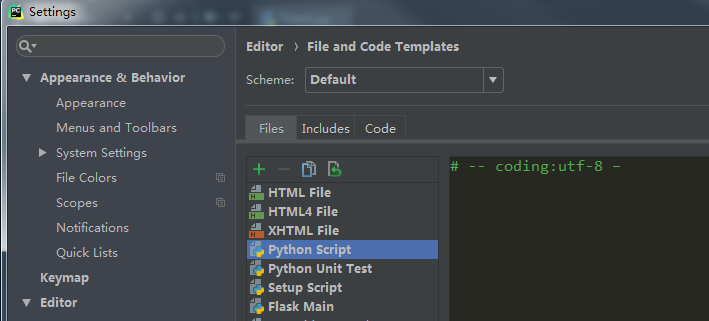


##### 补全忽略大小写

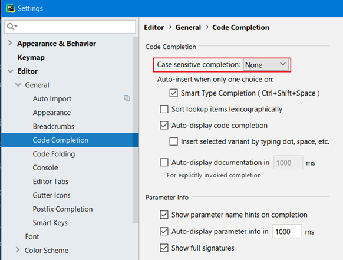


##### mongodb database plugins

file > settings > plugins 

search `mongo` , then install


##### 无法识别自己写的模块

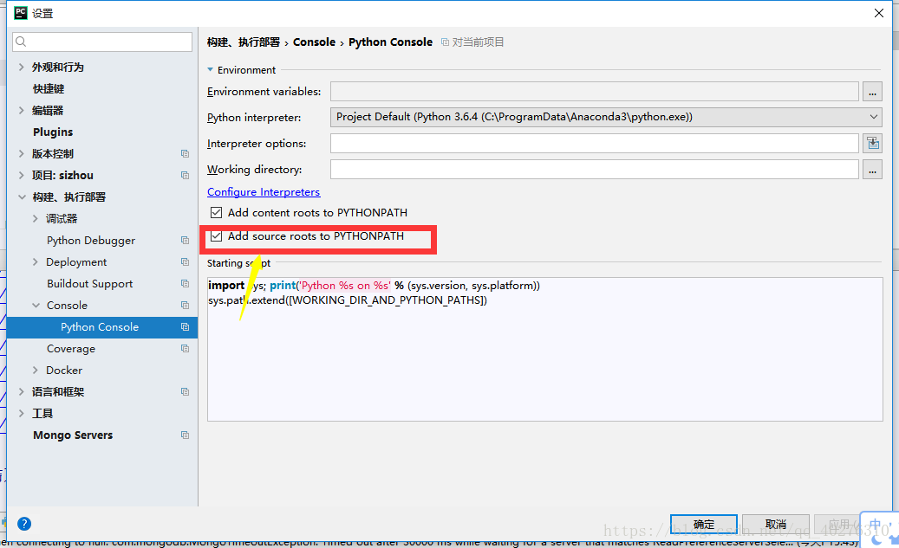

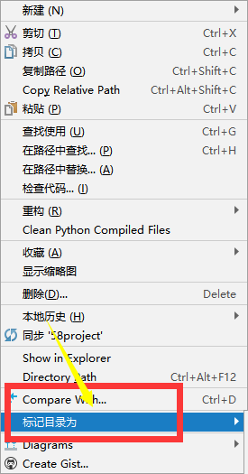


## Language Base

### 命名规范

https://blog.csdn.net/warm77/article/details/78353632


### 文件结构

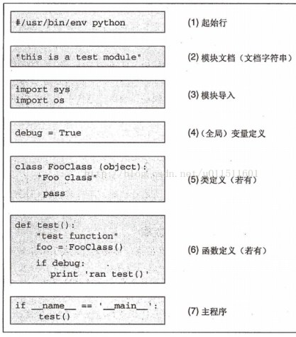


### 行连接

```python
# \
total = item1 + \
		item2 + \
    	item3

# 在 [], {}, () 不需要 \
total = ['item1','item2','item3',
        'item4'
        ]

# 同一行多条语句用 ; 分割
```


### 注释

```python
# 单行注释

'''
第三注释
第四注释
'''

"""
第五注释
第六注释
"""
```


## DataStruct


### 类型层次

[标准类型层次结构](https://docs.python.org/zh-cn/3/reference/datamodel.html#the-standard-type-hierarchy)


### 变量


- 单个变量

    ```python
    couter=100
    miles=100.0
    name="aaa"
    ```

- 多个变量

    ```python
    a=b=c=1 
    # 表示创建一个整型对象, 并将三个变量分配到相同的内存空间上. 
    a,b,c=1,2,'aaa' 
    # 表示两个整型对象1,2分配个a,b. 字符串aaa分配给c.
    ```


- 可变性

    不可变数据: 数字, 字符串, 元祖, 集合

    可变: 列表 字典

     

    > 不可变类型：变量赋值 `a=5` 后再赋值 `a=10`，这里实际是新生成一个 int 值对象 10，再让 a 指向它，而 5 被丢弃，不是改变 a 的值，相当于新生成了a。 
    >
    > 可变类型：变量赋值 `la=[1,2,3,4]` 后再赋值 `la[2]=5` 则是将 list la 的第三个元素值更改，本身la没有动，只是其内部的一部分值被修改了。


### 常量

没有常量定义, 规定全部大写变量名


### 逻辑值检测

https://docs.python.org/zh-cn/3/library/stdtypes.html#truth-value-testing


### 数值 int, float, complex

https://docs.python.org/zh-cn/3/library/stdtypes.html#numeric-types-int-float-complex

[math](https://yiyibooks.cn/xx/python_352/library/math.html#module-math)

[cmath](https://yiyibooks.cn/xx/python_352/library/math.html#module-math)


#### random

[random](file:///E:\Doc\API\python-3.7.0-docs-html\library\random.html)


### 迭代器 iterator

[迭代器类型](https://docs.python.org/zh-cn/3/library/stdtypes.html#iterator-types)


迭代器对象自身需要支持以下两个方法，它们共同组成了 *迭代器协议*:

- `iterator.__iter__`()

    返回迭代器对象本身。 这是同时允许容器和迭代器配合 [`for`](https://docs.python.org/zh-cn/3/reference/compound_stmts.html#for) 和 [`in`](https://docs.python.org/zh-cn/3/reference/expressions.html#in) 语句使用所必须的。 

- `iterator.__next__`()

    从容器中返回下一项。 如果已经没有项可返回，则会引发 [`StopIteration`](https://docs.python.org/zh-cn/3/library/exceptions.html#StopIteration) 异常。 


```python
In [1]: l = [1,2,3]

In [2]: i = iter(l)

In [3]: i.__iter__()
Out[3]: <list_iterator at 0x263831a5588>

In [4]: i.__next__()
Out[4]: 1

In [5]: i.__next__()
Out[5]: 2

In [6]: i.__next__()
Out[6]: 3

In [7]: i.__next__()
---------------------------------------------------------------------------
StopIteration                             Traceback (most recent call last)
<ipython-input-7-aa5506447029> in <module>
----> 1 i.__next__()

StopIteration:

```


容器对象要提供迭代支持，必须定义一个方法:

- `container.__iter__()`

    返回一个迭代器对象。 该对象需要支持下文所述的迭代器协议。 

[迭代器_教程](https://docs.python.org/zh-cn/3/tutorial/classes.html#iterators)


迭代器的用法:

```python
for element in [1, 2, 3]:
    print(element)
for element in (1, 2, 3):
    print(element)
for key in {'one':1, 'two':2}:
    print(key)
for char in "123":
    print(char)
for line in open("myfile.txt"):
    print(line, end='')
```


在幕后，[`for`](https://docs.python.org/zh-cn/3/reference/compound_stmts.html#for) 语句会调用容器对象中的 [`iter()`](https://docs.python.org/zh-cn/3/library/functions.html#iter)。 该函数返回一个定义了 [`__next__()`](https://docs.python.org/zh-cn/3/library/stdtypes.html#iterator.__next__) 方法的迭代器对象，该方法将逐一访问容器中的元素。 当元素用尽时，[`__next__()`](https://docs.python.org/zh-cn/3/library/stdtypes.html#iterator.__next__) 将引发 [`StopIteration`](https://docs.python.org/zh-cn/3/library/exceptions.html#StopIteration) 异常来通知终止 `for` 循环。 


- 自定义迭代器


给你的类添加迭代器行为就很容易了。 定义一个 [`__iter__()`](https://docs.python.org/zh-cn/3/reference/datamodel.html#object.__iter__) 方法来返回一个带有 [`__next__()`](https://docs.python.org/zh-cn/3/library/stdtypes.html#iterator.__next__) 方法的对象。 如果类已定义了 `__next__()`，则 [`__iter__()`](https://docs.python.org/zh-cn/3/reference/datamodel.html#object.__iter__) 可以简单地返回 `self`:

```python
class Reverse:
    """Iterator for looping over a sequence backwards."""
    def __init__(self, data):
        self.data = data
        self.index = len(data)

    def __iter__(self):
        return self

    def __next__(self):
        if self.index == 0:
            raise StopIteration
        self.index = self.index - 1
        return self.data[self.index]
    
r = Reverse("hello")
for i in r: print(i)
# o
# l
# l
# e
# h

```


### 生成器 generator

[Generator](https://docs.python.org/zh-cn/3/glossary.html#term-generator) 是一个用于创建迭代器的简单而强大的工具。 它们的写法类似标准的函数，但当它们要返回数据时会使用 [`yield`](https://docs.python.org/zh-cn/3/reference/simple_stmts.html#yield) 语句。 每次对生成器调用 [`next()`](https://docs.python.org/zh-cn/3/library/functions.html#next) 时，它会从上次离开位置恢复执行（它会记住上次执行语句时的所有数据值）。


#### 生成器表达式

https://docs.python.org/zh-cn/3/reference/expressions.html#generator-expressions

https://docs.python.org/zh-cn/3/tutorial/classes.html#generator-expressions


```python
>>> L = [x * x for x in range(10)]
>>> L
[0, 1, 4, 9, 16, 25, 36, 49, 64, 81]

>>> g = (x * x for x in range(10))
>>> g
<generator object <genexpr> at 0x1022ef630>
```


#### yield表达式

https://docs.python.org/zh-cn/3/reference/expressions.html#yield-expressions

https://docs.python.org/zh-cn/3/tutorial/classes.html#generators


当一个生成器函数被调用的时候，它返回一个迭代器，称为生成器。然后这个生成器来控制生成器函数的执行。当这个生成器的某一个方法被调用的时候，生成器函数开始执行。这时会一直执行到第一个 yield 表达式，在此执行再次被挂起，给生成器的调用者返回 [`expression_list`](https://docs.python.org/zh-cn/3/reference/expressions.html#grammar-token-expression-list) 的值。挂起后，我们说所有局部状态都被保留下来，包括局部变量的当前绑定，指令指针，内部求值栈和任何异常处理的状态。通过调用生成器的某一个方法，生成器函数继续执行。此时函数的运行就和 yield 表达式只是一个外部函数调用的情况完全一致。恢复后 yield 表达式的值取决于调用的哪个方法来恢复执行。 如果用的是 [`__next__()`](https://docs.python.org/zh-cn/3/reference/expressions.html#generator.__next__) (通常通过语言内置的 [`for`](https://docs.python.org/zh-cn/3/reference/compound_stmts.html#for) 或是 [`next()`](https://docs.python.org/zh-cn/3/library/functions.html#next) 来调用) 那么 yield表达式的值就是 [`None`](https://docs.python.org/zh-cn/3/library/constants.html#None). 否则，如果用 [`send()`](https://docs.python.org/zh-cn/3/reference/expressions.html#generator.send), 那么结果就是传递给send方法的值。


- `generator.__next__`()

    开始一个生成器函数的执行或是从上次执行的 yield 表达式位置恢复执行。 当一个生成器函数通过 [`__next__()`](https://docs.python.org/zh-cn/3/reference/expressions.html#generator.__next__)方法恢复执行时，当前的 yield 表达式总是取值为 [`None`](https://docs.python.org/zh-cn/3/library/constants.html#None)。 随后会继续执行到下一个 yield 表达式，其 [`expression_list`](https://docs.python.org/zh-cn/3/reference/expressions.html#grammar-token-expression-list) 的值会返回给 [`__next__()`](https://docs.python.org/zh-cn/3/reference/expressions.html#generator.__next__) 的调用者。 如果生成器没有产生下一个值就退出，则将引发 [`StopIteration`](https://docs.python.org/zh-cn/3/library/exceptions.html#StopIteration) 异常。此方法通常是隐式地调用，例如通过 [`for`](https://docs.python.org/zh-cn/3/reference/compound_stmts.html#for) 循环或是内置的 [`next()`](https://docs.python.org/zh-cn/3/library/functions.html#next) 函数。

- `generator.send`(*value*)

    恢复执行并向生成器函数“发送”一个值。 *value* 参数将成为当前 yield 表达式的结果。 [`send()`](https://docs.python.org/zh-cn/3/reference/expressions.html#generator.send) 方法会返回生成器所产生的下一个值，或者如果生成器没有产生下一个值就退出则会引发 [`StopIteration`](https://docs.python.org/zh-cn/3/library/exceptions.html#StopIteration)。 当调用 [`send()`](https://docs.python.org/zh-cn/3/reference/expressions.html#generator.send) 来启动生成器时，它必须以 [`None`](https://docs.python.org/zh-cn/3/library/constants.html#None) 作为调用参数，因为这时没有可以接收值的 yield 表达式。

- `generator.hrow`(*type*[, *value*[, *traceback*]])

    在生成器暂停的位置引发 `type` 类型的异常，并返回该生成器函数所产生的下一个值。 如果生成器没有产生下一个值就退出，则将引发 [`StopIteration`](https://docs.python.org/zh-cn/3/library/exceptions.html#StopIteration) 异常。 如果生成器函数没有捕获传入的异常，或引发了另一个异常，则该异常会被传播给调用者。

- `generator.close`()

    在生成器函数暂停的位置引发 [`GeneratorExit`](https://docs.python.org/zh-cn/3/library/exceptions.html#GeneratorExit)。 如果之后生成器函数正常退出、关闭或引发 [`GeneratorExit`](https://docs.python.org/zh-cn/3/library/exceptions.html#GeneratorExit)(由于未捕获该异常) 则关闭并返回其调用者。 如果生成器产生了一个值，关闭会引发 [`RuntimeError`](https://docs.python.org/zh-cn/3/library/exceptions.html#RuntimeError)。 如果生成器引发任何其他异常，它会被传播给调用者。 如果生成器已经由于异常或正常退出则 [`close()`](https://docs.python.org/zh-cn/3/reference/expressions.html#generator.close) 不会做任何事。


简单实用生成器:

```python
# 菲波拉契数 函数形式
def fib(max):
    n,a,b = 0,0,1
    l = []
    while n<max:
        l.append(b)
        a,b = b,a+b
        n+=1
    return l

print(fib(8))
# [1, 1, 2, 3, 5, 8, 13, 21]
```


```python
# 菲波拉契数 生成器形式
def fib(max):
    n,a,b = 0,0,1
    while n<max:
        yield b
        a,b = b,a+b
        n+=1

g= fib(5)

# print(g)
# <generator object fib at 0x00000142903D5248>

# for i in g: print(i)
# ...

# 调用 __next__()
# print(g.__next__())   # 1
# print(g.__next__())   # 1
# print(g.__next__())   # 2
# print(g.__next__())   # 3
# print(g.__next__())   # 5
# print(g.__next__())   # 最后一个 抛出异常
```


send 案例

```python
def func():
    print(123)
    content = yield 1
    print('====', content)
    print(456)
    yield 2


f = func()
ret = f.__next__()
# 123
print(ret)
# 1

# ret = f.__next__()
# print(ret)
# ==== None
# 用的是 __next__(), 那么yield表达式的值就是 None

ret = f.send('hello')
# print(ret)
# ==== hello
# 用的是 send(), 那么yield表达式的值就是 参数

# 继续往下执行
# 456
# 2

```


复杂案例:


#### generator method

https://docs.python.org/zh-cn/3/reference/expressions.html#generator-iterator-methods


### 序列类型

[通用序列操作](https://docs.python.org/zh-cn/3/library/stdtypes.html#common-sequence-operations)

[不可变序列类型](https://docs.python.org/zh-cn/3/library/stdtypes.html#immutable-sequence-types)

[可变序列类型](https://docs.python.org/zh-cn/3/library/stdtypes.html#mutable-sequence-types)


#### 列表

[列表](https://docs.python.org/zh-cn/3/library/stdtypes.html#lists)

[列表作为栈使用](https://docs.python.org/zh-cn/3/tutorial/datastructures.html#using-lists-as-stacks)

[列表作为队列使用](https://docs.python.org/zh-cn/3/tutorial/datastructures.html#using-lists-as-queues)

[列表推导式](https://docs.python.org/zh-cn/3/tutorial/datastructures.html#list-comprehensions)


##### list and str


字符串转列表

```python
str1 = "hi hello world"
print(str1.split(" "))

# ['hi', 'hello', 'world']
```

 

列表转字符串

```python
l = ["hi","hello","world"]
print(" ".join(l))

# hi hello world
```


#### 元组

[元组](https://docs.python.org/zh-cn/3/library/stdtypes.html#tuples)


#### range

[range 对象](https://docs.python.org/zh-cn/3/library/stdtypes.html#ranges)


### 序列类型

[序列类型 --- `list`, `tuple`, `range`](https://docs.python.org/zh-cn/3/library/stdtypes.html#sequence-types-list-tuple-range)

[通用序列操作](https://docs.python.org/zh-cn/3/library/stdtypes.html#common-sequence-operations)

[可变序列](https://docs.python.org/zh-cn/3/library/stdtypes.html#immutable-sequence-types)

[不可变序列](https://docs.python.org/zh-cn/3/library/stdtypes.html#immutable-sequence-types)


#### 列表

[列表](https://docs.python.org/zh-cn/3/library/stdtypes.html#lists)

[列表_教程](https://docs.python.org/zh-cn/3/tutorial/introduction.html#lists)


#### 元组

[元组](https://docs.python.org/zh-cn/3/library/stdtypes.html#tuples)


#### range

[range](https://docs.python.org/zh-cn/3/library/stdtypes.html#ranges)

[range_教程](https://docs.python.org/zh-cn/3/tutorial/controlflow.html#the-range-function)


### str

[文本序列类型 --- str](https://docs.python.org/zh-cn/3/library/stdtypes.html#text-sequence-type-str)

[字符串和字节串字面值](https://docs.python.org/zh-cn/3/reference/lexical_analysis.html#strings)


#### method

[str method](https://docs.python.org/zh-cn/3/library/stdtypes.html#string-methods)


##### strip()


传入多个字符参数的情况   

```python
a="aabcacb1111acbba"

print(a.strip("abc"))   # 1111
print(a.strip("acb"))   # 1111
print(a.strip("bac"))   # 1111
print(a.strip("bca"))   # 1111
print(a.strip("cab"))   # 1111
print(a.strip("cba"))   # 1111
```

 

重要的是函数只知道你要删除的字符是”a”，”b”，”c”。函数会把你传的参数拆解成一个个的字符，然后把头尾的这些字符去掉


#### str格式化

https://www.runoob.com/python/att-string-format.html


#### str & bytes

http://localhost:8888/notebooks/DataStruct/str.ipynb#str-&-bytes-convert


### 二进制序列类型

https://docs.python.org/zh-cn/3/library/stdtypes.html#binary-sequence-types-bytes-bytearray-memoryview

#### bytes

[bytes](https://docs.python.org/zh-cn/3/library/stdtypes.html#bytes-objects)


#### bytearray

[bytearray](https://docs.python.org/zh-cn/3/library/stdtypes.html#bytearray-objects)


#### memoryview

[memoryview](https://docs.python.org/zh-cn/3/library/stdtypes.html#memory-views)


#### bytes 和 bytearray 操作

https://docs.python.org/zh-cn/3/library/stdtypes.html#bytes-and-bytearray-operations


#### M: struct

http://localhost:8888/notebooks/struct/struct.ipynb


#### detail


##### bytes and str convert

 

```python
b = b"example"
s = "example"

# str to bytes
print(bytes(s, encoding="utf8"))
print(str.encode(s))
# b'example'
# b'example'

# bytes to str
print(str(b, encoding="utf8"), errors='ignore')
print(bytes.decode(b))
# example
# example
```


### set & frozenset

https://docs.python.org/zh-cn/3/library/stdtypes.html#set-types-set-frozenset


### dict

https://docs.python.org/zh-cn/3/library/stdtypes.html#mapping-types-dict


- 视图对象可以动态查看字典内容, 因此每次字典发生变化时, 视图都会相应改变

    ```python
    In [1]: words = {'a':1,'b':2}
    
    In [2]: words.items()
    Out[2]: dict_items([('a', 1), ('b', 2)])
    
    In [3]: words['c']=3
    
    In [4]: words.items()
    Out[4]: dict_items([('a', 1), ('b', 2), ('c', 3)])
    ```

    


## Statement


### 运算符

- 算术

    `+` (一元)

    `-` (一元): 返回负数

    `~` (一元): 取反

    `+ - * /`

    `%`: 模运算, 取余运算

    `**`: 幂运算

    `//`: 取整运算

- 比较

    `< > ==  >= <= !=`

    `is [not]`

    `[not] in`

- 赋值

    `=`

    `+= -= *= /= %= **= //=`

- 位运算

| 运算符 | 描述                                                                                               | 实例                                                                      |
|--------|--------------------------------------------------------------------------------------------------|-------------------------------------------------------------------------|
| &      | 按位与运算符：参与运算的两个值,如果两个相应位都为1,则该位的结果为1,否则为0                          | (a & b) 输出结果 12 ，二进制解释： 0000 1100                                |
| \|     | 按位或运算符：只要对应的二个二进位有一个为1时，结果位就为1。                                          | (a \| b) 输出结果 61 ，二进制解释： 0011 1101                               |
| ^      | 按位异或运算符：当两对应的二进位相异时，结果为1                                                      | (a ^ b) 输出结果 49 ，二进制解释： 0011 0001                                |
| ~      | 按位取反运算符：对数据的每个二进制位取反,即把1变为0,把0变为1 。**~x** 类似于 **-x-1**                | (~a ) 输出结果 -61 ，二进制解释： 1100 0011，在一个有符号二进制数的补码形式。 |
| <<     | 左移动运算符：运算数的各二进位全部左移若干位，由 **<<** 右边的数字指定了移动的位数，高位丢弃，低位补0。 | a << 2 输出结果 240 ，二进制解释： 1111 0000                                |
| >>     | 右移动运算符：把">>"左边的运算数的各二进位全部右移若干位，**>>** 右边的数字指定了移动的位数          | a >> 2 输出结果 15 ，二进制解释： 0000 1111                                 |

- 逻辑

    `and`

    `or`

    `not`


#### 运算符优先级

https://docs.python.org/zh-cn/3/reference/expressions.html#operator-precedence


### 切片

https://docs.python.org/zh-cn/3/reference/expressions.html#slicings

格式:

`[begin:end:step]`

 

参数:

str,字符串.

begin,起始位置.

end,结束位置.

step,间隔.s不等于0.默认为1

 

注:

区间为左闭右开.

step>0,表示从左往右,begin默认为0

step<0,表示从右往左,begin默认为-1


### 推导式


#### 列表推导式

列表推导式由一对方括号组成，方括号包含一个表达式，其后跟随一个for子句，然后是零个或多个for或if子句。结果将是一个新的列表，其值来自将表达式在其后的for和if子句的上下文中求值得到的结果。

```python
squares = [x**2 for x in range(10)]
print(squares)
# [0, 1, 4, 9, 16, 25, 36, 49, 64, 81]

squares = [[x, x**2] for x in [2,4,6]]
print(squares)
# [[2,4], [4,16], [6,36]]
```

如果`[]`改成`()`即可得到生成器.

如果`[]`改成`{}`即可得到集合.


#### 字典推导式

```python
# demo2: key,value 互换
d = {'a':10, 'b':20, 'c':30}
print(d.items())
# dict_items([('a', 10), ('b', 20), ('c', 30)])
r = {v:k for k, v in d.items()}
# {10: 'a', 20: 'b', 30: 'c'}
print(r)

```

#### if 过滤器

```python
l1 = [2,4,6]
l2 = [3*x for x in l1 if x>3]
print(l2)
# [12,18]

```


### 序列解包


### global & nonlocal

http://localhost:8888/notebooks/statement/global%20%26%20nonlocal.ipynb#


### if 语句

https://docs.python.org/zh-cn/3/reference/compound_stmts.html#the-if-statement

#### 模拟三目运算

```python
x =0
y = 2

max = x if(x>y) else y

print(max)
```

### while 语句

https://docs.python.org/zh-cn/3/reference/compound_stmts.html#the-while-statement

### for 语句

https://docs.python.org/zh-cn/3/reference/compound_stmts.html#the-for-statement

### try 语句

https://docs.python.org/zh-cn/3/reference/compound_stmts.html#the-try-statement

### with

[with 语句](https://docs.python.org/zh-cn/3/reference/compound_stmts.html#the-with-statement)

[上下文管理器类型](https://docs.python.org/zh-cn/3/library/stdtypes.html#context-manager-types)


with语句执行过程:

1. 调用`__enter__()`. 任何返回值都绑定到 as 语句
2. 执行内部代码块
3. 调用`__exit__()`


```python
# simple
with context_manager:
    pass

# 需要用到上下文变量
with context_manager as c:
    pass

# 多个上下文同时使用:
with A() as a, B() as b:
    pass
```


- 实现上下文管理协议案例:


### 类定义

https://docs.python.org/zh-cn/3/reference/compound_stmts.html#class-definitions

### 协程

https://docs.python.org/zh-cn/3/reference/compound_stmts.html#coroutines


## 函数

### 函数定义

https://docs.python.org/zh-cn/3/reference/compound_stmts.html#function-definitions


[函数定义_教程](https://docs.python.org/zh-cn/3/tutorial/controlflow.html#defining-functions)

#### 参数

- 位置参数 / 形式参数
  
    ```python
    def f1(str):
        print(str)
        return

    f1('hello')
    ```

- 参数默认值

    https://docs.python.org/zh-cn/3/tutorial/controlflow.html#default-argument-values


- 关键字参数

    https://docs.python.org/zh-cn/3/tutorial/controlflow.html#keyword-arguments


- 参数列表及参数解包

    `*args` 表示任何多个无名参数，它本质是一个 tuple
    
    `**kwargs` 表示关键字参数，它本质上是一个 dict

    ```python
    In [1]: def fun(*args,**kwargs):
    ...:     print('args=',args)
    ...:     print('kwargs=',kwargs)
    ...:

    In [2]: fun(1,2,3,4,A='a',B='b',C='c',D='d')
    args= (1, 2, 3, 4)
    kwargs= {'A': 'a', 'B': 'b', 'C': 'c', 'D': 'd'}
    ```

    `*args` demo:

    ```python
    In [3]: def fun(name,*args):
    ...:     print('hello:',name)
    ...:     for i in args:
    ...:         print('you have pet:',i)
    ...:

    In [4]: fun('xb','dog','cat','pig')
    hello: xb
    you have pet: dog
    you have pet: cat
    you have pet: pig

    ```

    `**kargs` demo:

    ```python
    >>> def fun(**kwargs):
    ...     for key, value in kwargs.items():
    ...         print("{0} 喜欢 {1}".format(key, value))
    ... 
    >>> fun(Geek="cat", cat="box")
    Geek 喜欢 cat
    cat 喜欢 box

    ```

### lambda

https://docs.python.org/zh-cn/3/reference/expressions.html#lambda


### 递归函数

```python
def fact(n):
    if n==1:
        return 1
return n * fact(n - 1)

```

### 偏函数

```python
int('12345')        # 12345

# 转成二进制
def int2(x,base=2):
    return int(x,base)

int2('1000000')        # 64
```

#### M: functools

`functools.partial`的作用就是，把一个函数的某些参数给固定住（也就是设置默认值），返回一个新的函数.

```python
import functools
int2 = functools.partial(int, base=2)
int2('1000000')        # 64
```


### 闭包

http://localhost:8888/notebooks/statement/%E9%97%AD%E5%8C%85.ipynb

### 装饰器


### Built-in Functions

[内置函数](https://docs.python.org/zh-cn/3/library/functions.html#built-in-functions)

http://localhost:8888/tree/BuiltinFunction


## OOP


### cls & self

cls代表类本身

self代表类实例本身

类方法必须包含参数 self, 且为第一个参数.

如果使用了@staticmethod, 那就无视这个self, 而将这个方法当成一个普通函数. 

对于@classmethod, 它的第一个参数不是self, 而是cls

### 属性


- 类属性 & 实例属性

```python
class People():
	# 类属性, 被所有类对象所共有
	address = 'xx'
	
	def __init__(self):
		# 实例属性
		self.name = 'xxx'
```


- 类方法 & 静态方法

    类方法是类对象所拥有的方法，需要用修饰器`@classmethod`来标识其为类方法，对于类方法，一般以`cls`作为第一个参数，能够通过实例对象和类对象去访问。

     

    静态方法通过修饰器`@staticmethod`来进行修饰，静态方法不需要多定义参数,因此在静态方法中引用类属性的话，必须通过类对象来引用. 如果有`self`, 会忽略.

    

    ```python
    class Classname:
        @staticmethod
        def fun():      # 注意这里没有参数
            print('静态方法')
    
        @classmethod    
        def a(cls):     # 注意这里 cls 参数
            print('类方法')
    
        # 普通方法
        def b(self):    # 注意这里 self 参数
            print('普通方法')
    
    
    C = Classname()
    
    # 调用普通方法
    C.b()
    
    # 调用类方法
    Classname.a()
    C.a()
    
    # 调用静态方法
    Classname.fun()
    C.fun()
    
    ```


- 私有属性

    `__属性`会自动变形成 `_类名__属性`

    同时重写 `__dir__()`


​		单下划线是阻止 `from module import * `导入


### 继承

```python
# 定义父类
class ParentClass1:  
    pass

# 定义父类
class ParentClass2:  
    pass

# 单继承，基类是ParentClass1，派生类是SubClass
class SubClass1(ParentClass1):  
    pass

# python支持多继承，用逗号分隔开多个继承的类
class SubClass2(ParentClass1, ParentClass2):  
    pass


# 查看继承
# __base__只查看从左到右继承的第一个子类
# __bases__则是查看所有继承的父类

print(SubClass2.__base__)
# <class '__main__.ParentClass1'>
print(SubClass2.__bases__)
# (<class '__main__.ParentClass1'>, <class '__main__.ParentClass2'>)


# 如果没有指定基类，python的类会默认继承object类，object是所有python类的基类
print(ParentClass1.__bases__)
# (<class 'object'>,)

# 查看一个类的继承层次
print(SubClass2.__mro__)
# (<class '__main__.SubClass2'>, <class '__main__.ParentClass1'>, <class '__main__.ParentClass2'>, <class 'object'>)


s1 = SubClass1()
s2 = SubClass2()

# type()    返回对象的类型, 不考虑继承关系
print(type(s1))      # <class '__main__.SubClass1'>
print(type(s2))      # <class '__main__.SubClass2'>
print(type(1))       # <class 'int'>
print(type('aaa'))   # <class 'str'>

# isinstance(object, classinfo)  判断 object 是否是 classinfo 类型，考虑继承关系。
print(isinstance(s1, ParentClass1))  # True
print(type(s1) == ParentClass1)      # False

# issubclass(class, classinfo)  判断 class 是否是 classinfo 的子类。
# print(issubclass(s1, ParentClass1))  # error
print(issubclass(SubClass1, ParentClass1))  # True

```


#### 抽象类

```python
class animal():
    def __init__(self):
        pass

    def eat(self):
        print('animal need to eat')
        pass


class dog(animal):

    def __init__(self):
        print('a new dog')

    def eat(self):
        print('dog eat meat')


class cat(animal):

    def __init__(self):
        print('a new cat')

    def eat(self):
        super().eat()
        animal().eat()
        print('cat eat fish')


d = dog()
# a new dog
c = cat()
# a new cat
d.eat()
# dog eat meat
c.eat()
# animal need to eat
# animal need to eat
# cat eat fish

```


子类调用父类属性:

`super().xxx`or `baseClassName().xxx`


### 多态

```python
class Animal():
    def talk(self):
        pass


class People(Animal):  # 动物的形态之一:人
    def talk(self):
        print('say hello')


class Dog(Animal):  # 动物的形态之二:狗
    def talk(self):
        print('say wangwang')


class Cat(Animal):  # 动物的形态之三:猪
    def talk(self):
        print('say miaomiao')


def func(object):
    object.talk()


p = People()
d = Dog()
c = Cat()

func(p)
# say hello
func(d)
# say wangwang
func(c)
# say miaomiao

```

### 特殊方法名称

https://docs.python.org/zh-cn/3/reference/datamodel.html#special-method-names


`__doc__`

类的文档字符串  
获取导入文件的路径加文件名称，路径以点分割，注意:获取当前文件返回__main__

`__name__`

全局变量写在入口文件里，只有执行入口文件时的返回值才是`__main__` ，如果入口文件被导入到别的文件里，此时入口文件的`__name__`返回值就不在是`__main__`，而是文件的路径加入口文件名称，所以我们可以用`__name__`全局变量来防止别人盗链入口文件


`__module__`

类定义所在的模块

`__base__`  
`__bases__`

类的所有父类构成元素（包含了以个由所有父类组成的元组）

`__file__`

获取当前文件的路径  
一般配合os模块的os.path.dirname()，os.path.basename() ，os.path.join() 模块函数来使用

`__package__`

`__builtins__`

内置函数在这里面

`__cached__`

获取导入文件的缓存路径

```python
class Demo():
    """
    this is doc of the class
    """
    x = 1
    y = 2
    z = 3


d = Demo()
print(d.__doc__)
# this is doc of the class
print(Demo.__doc__)
# this is doc of the class
print(__file__)
# e:/Project/demo/python_base/demo.py
```

`__class__`

表示当前操作的对象的类是什么

`__dict__`

类或对象中的所有成员

`__new__()`

返回值应该是新的对象实例（通常是CLS的一个实例）。 如果返回值不是CLS的实例, 那么新实例的init()方法不会执行.

`__init__()`

类的构造函数, 在实例（被new()）创建之后，返回给调用者之前调用。

`__del__()`

类的析构函数, 在对象销毁时执行.

```python
class Test(object):
    def __new__(cls, *args, **kwargs):
        print('new')        # new
        print('cls:', cls)    # cls: cls: <class '__main__.Test'>
        print(id(cls))        # 12721432
        return object.__new__(cls)  # 当前传入的cls是Test对象

    def __init__(self):
        print('init')

    def __del__(self):
        print('del')


t = Test()
print(Test)
print(t)
# new
# cls: <class '__main__.Test'>
# 53598568
# init
# <class '__main__.Test'>
# del
# <__main__.Test object at 0x03AE4FB0>
```

`__repr__()`  
`__str__()`

先看下repr()和str()区别

repr(): 打印出 python 理解的字符串  
str(): 打印出 用户 理解的字符串

`__repr__()`和`__str__()`就是用来定义打印对象时应该显示的东西, 只不过显示的格式不同:

如果没有定义 `__str__()`或`__repr__()`, 那么打印对象的时候就将打印一个地址值.

`__call__()`

对象后面加括号，触发执行。

注：构造方法的执行是由创建对象触发的，即：对象 = 类名() ；而对于 __call__方法的执行是由对象后加括号触发的，即：对象() 或者 类()()

`__getitem__()`  
`__setitem__()`  
`__delitem__()`  

用于索引操作，如字典。以上分别表示获取、设置、删除数据

```python
class Foo(object):

    def __getitem__(self, key):
        print '__getitem__',key

    def __setitem__(self, key, value):
        print '__setitem__',key,value

    def __delitem__(self, key):
        print '__delitem__',key


obj = Foo()

result = obj['k1']      # 自动触发执行 __getitem__
obj['k2'] = 'wupeiqi'   # 自动触发执行 __setitem__
del obj['k1']           # 自动触发执行 __delitem__
```

`__iter__()`

用于迭代器，之所以列表、字典、元组可以进行for循环，是因为类型内部定义了 iter

```python
class Foo(object):

    def __init__(self, sq):
        self.sq = sq

    def __iter__(self):
        return iter(self.sq)


obj = Foo([11, 22, 33, 44])

for i in obj:
    print(i)
```


## file & folder

### input & print

[input()]https://docs.python.org/zh-cn/3/library/functions.html#input

[print()](https://docs.python.org/zh-cn/3/library/functions.html#print)

### open()

https://docs.python.org/zh-cn/3/library/functions.html#open

> `name` : 一个包含了你要访问的文件名称的字符串值。  
> `mode` : mode 决定了打开文件的模式：只读，写入，追加等。所有可取值见如下的完全列表。这个参数是非强制的，默认文件访问模式为只读(r)。  
> `buffering` : 如果 buffering 的值被设为 0，就不会有寄存。如果 buffering 的值取 1，访问文件时会寄存行。如果将 buffering 的值设为大于 1 的整数，表明了这就是的寄存区的缓冲大小。如果取负值，寄存区的缓冲大小则为系统默认。
> 返回值 file 对象  

由open()函数返回的file object的类型取决于模式。

当open()用于以文本模式打开文件时（'w'，'r'，'wt'，'rt'等），它返回io.TextIOBase的子类（特别是io.TextIOWrapper）。

当用缓冲区以二进制模式打开文件时，返回的类是io.BufferedIOBase的子类。确切的类有所不同：在读取二进制模式下，它返回一个io.BufferedReader；在写入二进制和附加二进制模式时，它返回一个io.BufferedWriter，并且在读/写模式下，它返回一个io.BufferedRandom。当禁用缓冲时，将返回原始流（io.RawIOBase，io.FileIO的子类）。

当处理一个文件对象时, 使用 with 关键字是非常好的方式。在结束后, 它会帮你正确的关闭文件。


```python
with open('/tmp/foo.txt', 'r') as f:
    data = f.read()
```

- mode

字符 | 含义
-----|----------------------------------------------------------------------------------
\+   | 打开磁盘文件进行更新（读取和写入）
a    | 打开写入，追加到文件末尾（如果存在）
a+   | 打开一个文件用于读写。如果该文件已存在，文件指针将会放在文件的结尾。文件打开时会是追加模式。如果该文件不存在，创建新文件用于读写。
ab   | 以二进制格式打开一个文件用于追加。如果该文件已存在，文件指针将会放在文件的结尾。也就是说，新的内容将会被写入到已有内容之后。如果该文件不存在，创建新文件进行写入。
ab+  | 以二进制格式打开一个文件用于追加。如果该文件已存在，文件指针将会放在文件的结尾。如果该文件不存在，创建新文件用于读写。
b    | 二进制模式
r    | 打开阅读（默认）
r+   | 打开一个文件用于读写。文件指针将会放在文件的开头。
rb   | 以二进制格式打开一个文件用于只读。文件指针将会放在文件的开头。这是默认模式。
rb+  | 以二进制格式打开一个文件用于读写。文件指针将会放在文件的开头。
t    | 文本模式（默认）
w    | 打开写入，首先截断文件
w+   | 打开一个文件用于读写。如果该文件已存在则将其覆盖。如果该文件不存在，创建新文件。
wb   | 以二进制格式打开一个文件只用于写入。如果该文件已存在则将其覆盖。如果该文件不存在，创建新文件。
wb+  | 以二进制格式打开一个文件用于读写。如果该文件已存在则将其覆盖。如果该文件不存在，创建新文件。
x    | 打开独占创建，如果文件已经存在则失败


#### file method

see more in [IO](https://docs.python.org/zh-cn/3/library/io.html) module

`close()`

关闭文件。关闭后文件不能再进行读写操作。

`flush()`

刷新文件内部缓冲，直接把内部缓冲区的数据立刻写入文件, 而不是被动的等待输出缓冲区写入。

`fileno()`

返回一个整型的文件描述符(file descriptor FD 整型), 可以用在如os模块的read方法等一些底层操作上。

`isatty()`

如果文件连接到一个终端设备返回 True，否则返回 False。

`next()`

返回文件下一行。

`read([size])`

从文件读取指定的字节数，如果未给定或为负则读取所有。

`readline([size])`

读取整行，包括 "\n" 字符。

`readlines([sizeint])`

读取所有行并返回列表，若给定sizeint>0，返回总和大约为sizeint字节的行, 实际读取值可能比 sizeint 较大, 因为需要填充缓冲区。

`seek(offset[, whence])`

设置文件当前位置

注意：这个文件指针的改变只是作用于'r',对'w'和'a'不会起作用，如果是'w'，那么write()永远都是从开头写（会覆盖后面对应位置的内容），是'a'的话write()就永远都是从最后开始追加。

`tell()`

返回文件当前位置。

`truncate([size])`

从文件的首行首字符开始截断，截断文件为 size 个字符，无 size 表示从当前位置截断；截断之后后面的所有字符被删除，其中 Widnows 系统下的换行代表2个字符大小。

`write(str)`

将字符串写入文件，返回的是写入的字符长度。

`writelines(sequence)`

向文件写入一个序列字符串列表，如果需要换行则要自己加入每行的换行符。

### shutil module

```python
#文件、文件夹的移动、复制、删除、重命名

#导入shutil模块和os模块
import shutil,os

#复制单个文件
shutil.copy("C:\\a\\1.txt","C:\\b")
#复制并重命名新文件
shutil.copy("C:\\a\\2.txt","C:\\b\\121.txt")
#复制整个目录(备份)
shutil.copytree("C:\\a","C:\\b\\new_a")

#删除文件
os.unlink("C:\\b\\1.txt")
os.unlink("C:\\b\\121.txt")
#删除空文件夹
try:
    os.rmdir("C:\\b\\new_a")
except Exception as ex:
    print("错误信息："+str(ex))#提示：错误信息，目录不是空的
#删除文件夹及内容
shutil.rmtree("C:\\b\\new_a")

#移动文件
shutil.move("C:\\a\\1.txt","C:\\b")
#移动文件夹
shutil.move("C:\\a\\c","C:\\b")

#重命名文件
shutil.move("C:\\a\\2.txt","C:\\a\\new2.txt")
#重命名文件夹
shutil.move("C:\\a\\d","C:\\a\\new_d")

```

## 异常

### raise

抛出异常.

`raise [Exception [, args [, traceback]]]`

raise语句如果不带参数，就会把当前错误原样抛出.


Demo: 使用raise语句抛出一个指定的异常

```python
raise NameError('HiThere')

Traceback (most recent call last):
  File "<stdin>", line 1, in ?
NameError: HiThere


try:
    raise NameError('HiThere')
except NameError:
    print('An exception flew by!')
    raise

An exception flew by!
Traceback (most recent call last):
  File "<stdin>", line 2, in ?
NameError: HiThere
```


### try...except...finnaly

```python
try:
    pass
except 异常 as 变量:        # 变量用于存储异常
    pass
else:                        # 没有捕获到异常情况下执行的语句
    pass
finally:                    # 不管有没有捕获到都执行的语句
    pass
```

单个异常

```python
except: 异常 as 变量:
    pass
```

多个异常

```python
except: (异常1, 异常2) as 变量1, 变量2:
    pass

except 异常1 as 变量1:
    pass
except 异常2 as 变量2:
    pass
```

所有异常

```python
except:
    pass
```


### 自定义异常

你可以用raise语句来引发一个异常。异常/错误对象必须有一个名字，且它们应是Error或Exception类的子类

```python
class ShortInputException(Exception):
    '''自定义的异常类'''
    def __init__(self, length, atleast):
        #super().__init__()
        self.length = length
        self.atleast = atleast

def main():
    try:
        s = input('请输入 --> ')
        if len(s) < 3:
            # raise引发一个你定义的异常
            raise ShortInputException(len(s), 3)
    except ShortInputException as result:    #x这个变量被绑定到了错误的实例
        print('ShortInputException: 输入的长度是 %d,长度至少应是 %d'% (result.length, result.atleast))
    else:
        print('没有异常发生.')

main()
```

关于代码`super().__init__()`的说明 这一行代码，可以调用也可以不调用，建议调用，因为init方法往往是用来对创建完的对象进行初始化工作，如果在子类中重写了父类的init方法，即意味着父类中的很多初始化工作没有做，这样就不保证程序的稳定了，所以在以后的开发中，如果重写了父类的init方法，最好是先调用父类的这个方法，然后再添加自己的功能

demo2

```python
# 基于RuntimeError类创建一个新的类
class Networkerror(RuntimeError):
    def __init__(self,args):
        self.args=args

if __name__ == '__main__':

    try:
        # 抛出一个Networkerror异常
        raise Networkerror("aaa")
    # 匹配异常的类型，当出现了Networkerror型异常时，执行该except语句，并传递变量e，变量 e 是用于创建Networkerror类的实例，这里的e应该就是这个异常对象？
    except  Networkerror as e:
        print(e.args)
```


## 包 & 模块

### 模块

模块是一个包含所有你定义的函数和变量的文件，其后缀名是`.py`
模块的模块名（做为一个字符串）可以由全局变量 `__name__` 得到


#### 导入模块


- `import A`

里面的内容通过 A.b来调用

- `from A import b`

b 可以直接用, A是没有定义的.

```python
from A import b
# 相当于:
import A
b = A.b
```

- `from A import b as c`

相当于:

```python
import A
c = A.b
```

`from A import *`

导入模块中所有内容.

这样会导入所有除了以下划线开头的命名。实际代码中这样做往往是不被鼓励的。

如果定义了在 `__init__.py`文件中定义了`__all__`, 则只导入该变量中的内容.

#### 模块的搜索路径

1.	当前目录
2.	环境变量PATH表示的目录列表中搜索
3.	Ptyon的默认安装路径中搜索。

### 包

包将有联系的模块组织在一起，即放到同一个文件夹下，并且在这个文件夹创建一个名字为 `__init__.py` 文件，那么这个文件夹就称之为包

作用: 有效避免模块名称冲突问题，让应用组织结构更加清晰

例如两个模块: recvmsg.py, sendmsg.py. 同在msg文件夹下:

`__init__py`文件内容:

```
__all__=['sendmsg', 'redvmsg']
```

其作用是控制包的导入行为.  
同时可以在该文件中编写语句, 到导入包时就会执行.

导入的时候可以分别导入两个模块, 也可以:

```python
from msg import *
```

#### 嵌套包

```python
# 假定有这么一个目录:
# Phone/
#     __init__.py
#     common_util.py
#     Voicedta/
#         __init__.py
#         Pots.py
#         Isdn.py
#     Fax/
#         __init__.py
#         G3.py
#     Mobile/
#         __init__.py
#         Analog.py
#         igital.py
#     Pager/
#         __init__.py
#         Numeric.py
# 每一级的__init__.py文件是必须存在的.

# 可以用import导入:
import Phone.Mobile.Analog
Phone.Mobile.Analog.dial()
# 也可以使用from...import...导入:
from Phone import Mobile
Mobile.Analog.dial('555-1212')
# 导入子包也是可以的:
from Phone.Mobile import Analog
Analog.dial('555-1212')
# 或者:
from Phone.Mobile.Analog import dial
dial('555-1212')
```


### 发布模块

1.	mymodule目录结构体如下：

```
.
├── setup.py
├── suba
│   ├── aa.py
│   ├── bb.py
│   └── __init__.py
└── subb
├── cc.py
├── dd.py
└── __init__.py
```


1.	编辑setup.py文件

py_modules需指明所需包含的py文件

```python
from distutils.core import setup
setup(name="dongGe", version="1.0", description="dongGe's module", author="dongGe", py_modules=['suba.aa', 'suba.bb', 'subb.cc', 'subb.dd'])
```

1.	构建模块

```python
python setup.py build
```

构建后目录结构

```
.
├── build
│   └── lib.linux-i686-2.7
│├── suba
││   ├── aa.py
││   ├── bb.py
││   └── __init__.py
│└── subb
│    ├── cc.py
│    ├── dd.py
│    └── __init__.py
├── setup.py
├── suba
│   ├── aa.py
│   ├── bb.py
│   └── __init__.py
└── subb
    ├── cc.py
    ├── dd.py
    └── __init__.py
```

1.	生成发布压缩包

python setup.py sdist

打包后,生成最终发布压缩包dongGe-1.0.tar.gz , 目录结构

```
.
├── build
│   └── lib.linux-i686-2.7
│├── suba
││   ├── aa.py
││   ├── bb.py
││   └── __init__.py
│└── subb
│    ├── cc.py
│    ├── dd.py
│    └── __init__.py
├── dist
│   └── dongGe-1.0.tar.gz
├── MANIFEST
├── setup.py
├── suba
│   ├── aa.py
│   ├── bb.py
│   └── __init__.py
└── subb
    ├── cc.py
    ├── dd.py
    └── __init__.py
```

- 模块安装

1.	找到模块的压缩包
2.	解压
3.	进入文件夹
4.	执行命令 `python setup.py install`

注意： 如果在install的时候，执行目录安装，可以使用python setup.py install --prefix=安装路径


## 并发编程

### 概念

- CPU运行原理

我们都知道CPU的根本任务就是执行指令，对计算机来说最终都是一串由“0”和“1”组成的序列。CPU从逻辑上可以划分成3个模块，分别是控制单元、运算单元和存储单元，这三部分由CPU内部总线连接起来：
 
- 控制单元

控制单元是整个CPU的指挥控制中心，由指令寄存器IR(Instruction Register)、指令译码器ID(Instruction Decoder)和操作控制器OC(Operation Controller)等，对协调整个电脑有序工作极为重要。它根据用户预先编好的程序，依次从存储器中取出各条指令，放在指令寄存器IR中，通过指令译码(分析)确定应该进行什么操作，然后通过操作控制器OC，按确定的时序，向相应的部件发出微操作控制信号。操作控制器OC中主要包括节拍脉冲发生器、控制矩阵、时钟脉冲发生器、复位电路和启停电路等控制逻辑。

- 运算单元

是运算器的核心。可以执行算术运算(包括加减乘数等基本运算及其附加运算)和逻辑运算(包括移位、逻辑测试或两个值比较)。相对控制单元而言，运算器接受控制单元的命令而进行动作，即运算单元所进行的全部操作都是由控制单元发出的控制信号来指挥的，所以它是执行部件。

- 存储单元 

包括CPU片内缓存和寄存器组，是CPU中暂时存放数据的地方，里面保存着那些等待处理的数据，或已经处理过的数据，CPU访问寄存器所用的时间要比访问内存的时间短。采用寄存器，可以减少CPU访问内存的次数，从而提高了CPU的工作速度。但因为受到芯片面积和集成度所限，寄存器组的容量不可能很大。寄存器组可分为专用寄存器和通用寄存器。专用寄存器的作用是固定的，分别寄存相应的数据。而通用寄存器用途广泛并可由程序员规定其用途，通用寄存器的数目因微处理器而异。
cpu的工作原理：
 
总的来说，CPU从内存中一条一条地取出指令和相应的数据，按指令操作码的规定，对数据进行运算处理，直到程序执行完毕为止。

控制单元在时序脉冲的作用下，将指令计数器里所指向的指令地址(这个地址是在内存里的)送到地址总线上去，然后CPU将这个地址里的指令读到指令寄存器进行译码。对于执行指令过程中所需要用到的数据，会将数据地址也送到地址总线，然后CPU把数据读到CPU的内部存储单元(就是内部寄存器)暂存起来，最后命令运算单元对数据进行处理加工。

cpu的工作效率：

基本上，CPU就是这样去执行读出数据、处理数据和往内存写数据3项基本工作。但在通常情况下，一条指令可以包含按明确顺序执行的许多操作，CPU的工作就是执行这些指令，完成一条指令后，CPU的控制单元又将告诉指令读取器从内存中读取下一条指令来执行。这个过程不断快速地重复，快速地执行一条又一条指令，产生你在显示器上所看到的结果。我们很容易想到，在处理这么多指令和数据的同时，由于数据转移时差和CPU处理时差，肯定会出现混乱处理的情况。为了保证每个操作准时发生，CPU需要一个时钟，时钟控制着CPU所执行的每一个动作。时钟就像一个节拍器，它不停地发出脉冲，决定CPU的步调和处理时间，这就是我们所熟悉的CPU的标称速度，也称为主频。主频数值越高，表明CPU的工作速度越快。

而在执行效率方面，一些厂商通过流水线方式或以几乎并行工作的方式执行指令的方法来提高指令的执行速度。刚才我们提到，指令的执行需要许多独立的操作，诸如取指令和译码等。最初CPU在执行下一条指令之前必须全部执行完上一条指令，而现在则由分布式的电路各自执行操作。也就是说，当这部分的电路完成了一件工作后，第二件工作立即占据了该电路，这样就大大增加了执行方面的效率。

另外，为了让指令与指令之间的连接更加准确，现在的CPU通常会采用多种预测方式来控制指令更高效率地执行。

IO密集型（不用CPU）: 多线程  
计算密集型（用CPU）: 多进程


### 线程

- windows下的线程

python里一个进程永远只能同时执行一个线程.

多线程编程，模型复杂，容易发生冲突，必须用锁加以隔离，同时，又要小心死锁的发生。

Python解释器由于设计时有GIL全局锁，导致了多线程无法利用多核。多线程的并发在Python中就是一个美丽的梦。

[GIL](https://www.cnblogs.com/xhnxhnu/p/9728239.html)

https://www.cnblogs.com/wf-skylark/p/9030690.html


### 进程

[multiprocessing](https://docs.python.org/zh-cn/3/library/multiprocessing.html)

参考:  
[python多进程](https://www.cnblogs.com/kaituorensheng/p/4445418.html)

python下想要充分利用多核CPU，就用多进程。因为每个进程有各自独立的GIL，互不干扰，这样就可以真正意义上的并行执行，在python中，多进程的执行效率优于多线程(仅仅针对多核CPU而言)。

> 直接在pycharm里是不能运行多进程程序的, 应该双击运行该py文件才会有反应.

#### 函数式创建进程

函数 单进程
```python
import os,time
import multiprocessing

def worker(name):
    print('worker >>>')
    n=5
    while n>0:
        print(f'\t{name} work')
        time.sleep(1)
        n-=1
    print('worker .')

if __name__ == '__main__':
    print('main >>>')
    p1 = multiprocessing.Process(target=worker,args=('a',))
    p1.start()
    print('main .')
```

函数 多进程
```python
import os, time
import multiprocessing


def worker(name):
    print('worker >>>')
    n = 5
    while n > 0:
        print(f'{name} work ...')
        time.sleep(1)
        n -= 1
    print('worker .')

if __name__ == '__main__':
    print('main >>>')
    p1 = multiprocessing.Process(target=worker, args=('a',))
    p2 = multiprocessing.Process(target=worker, args=('b',))
    p3 = multiprocessing.Process(target=worker, args=('c',))
    p1.start()
    p2.start()
    p3.start()
    print(f'the number of CPU is {multiprocessing.cpu_count()}')
    for p in multiprocessing.active_children():
        print(f"child name:{p.name} \t pid:{p.pid}")
    print('main .')
```


#### 类形式创建进程

```python
import os, time
import multiprocessing


class Workder(multiprocessing.Process):
    
    def __init__(self, name):
        super().__init__()
        self.name = name
    
    
    def run(self):
        print('woker >>>')
        n = 5
        while n > 0:
            print(f'\t{self.name} working')
            time.sleep(0.1)
            n -= 1
        print('worker .')


if __name__ == '__main__':
    print('main >>>')
    wa = Workder('a')
    wb = Workder('b')
    wc = Workder('c')
    wa.start()
    wb.start()
    wc.start()
    print('main .')

# main >>>
# main .
# woker >>>
# 	a working
# woker >>>
# 	b working
# woker >>>
# 	c working
# 	a working
# 	b working
# 	c working
# 	a working
# 	b working
# 	c working
# 	a working
# 	b working
# 	c working
# 	a working
# 	b working
# 	c working
# worker .
# worker .
# worker .
```

#### Process.daemon

进程 daemon=true, 则主进程结束,子进程也结束; 否则子进程独立结束

no deamon
```python
import os,time
import multiprocessing

def worker(name):
    print('worker >>>')
    n=5
    while n>0:
        print(f'\t{name} work')
        time.sleep(1)
        n-=1
    print('worker .')

if __name__ == '__main__':
    print('main >>>')
    p1 = multiprocessing.Process(target=worker,args=('a',))
    # p1.daemon=True
    p1.start()
    
    print('main sleep 4s')
    time.sleep(3)
    print('main .')

# main >>>
# main sleep 4s
# worker >>>
# 	a work
# 	a work
# 	a work
# main .
# 	a work
# 	a work
# worker .
```

daemon
```python
import os,time
import multiprocessing

def worker(name):
    print('worker >>>')
    n=5
    while n>0:
        print(f'\t{name} work')
        time.sleep(1)
        n-=1
    print('worker .')

if __name__ == '__main__':
    print('main >>>')
    p1 = multiprocessing.Process(target=worker,args=('a',))
    # p1.daemon=True
    p1.daemon=True
    p1.start()
    
    print('main sleep 4s')
    time.sleep(3)
    print('main .')

# main >>>
# main sleep 4s
# worker >>>
# 	a work
# 	a work
# 	a work
# main .
```

#### multiprocessing.Lock

#### multiprocessing.Pool

Pool可以提供指定数量的进程，供用户调用，当有新的请求提交到pool中时，如果池还没有满，那么就会创建一个新的进程用来执行该请求；但如果池中的进程数已经达到规定最大值，那么该请求就会等待，直到池中有进程结束，才会创建新的进程来它。

```python
import os,time
import multiprocessing

def worker(name):
    print('worker >>>')
    n=5
    while n>0:
        print(f'\t{name} work')
        time.sleep(1)
        n-=1
    print('worker .')

if __name__ == '__main__':
    print('main >>>')
    
    po = multiprocessing.Pool(processes=2)
    for i in range(8):
        # 非阻塞式调用, 等效于单线程
        po.apply_async(worker,(i,))
    po.close()
    po.join()
    print('main .')
```

#### multiprocessing.Queue

Queue是多进程安全的队列，可以使用Queue实现多进程之间的数据传递。

`put` 方法用以插入数据到队列中，put方法还有两个可选参数：blocked和timeout。如果blocked为True（默认值），并且timeout为正值，该方法会阻塞timeout指定的时间，直到该队列有剩余的空间。如果超时，会抛出Queue.Full异常。如果blocked为False，但该Queue已满，会立即抛出Queue.Full异常。
 
`get` 方法可以从队列读取并且删除一个元素。同样，get方法有两个可选参数：blocked和timeout。如果blocked为True（默认值），并且timeout为正值，那么在等待时间内没有取到任何元素，会抛出Queue.Empty异常。如果blocked为False，有两种情况存在，如果Queue有一个值可用，则立即返回该值，否则，如果队列为空，则立即抛出Queue.Empty异常。


## 异步

- 什么是异步

IO在计算机中指Input/Output，也就是输入和输出。由于程序和运行时数据是在内存中驻留，由CPU这个超快的计算核心来执行，涉及到数据交换的地方，通常是磁盘、网络等，就需要IO接口。

比如你打开浏览器，访问新浪首页，浏览器这个程序就需要通过网络IO获取新浪的网页。浏览器首先会发送数据给新浪服务器，告诉它我想要首页的HTML，这个动作是往外发数据，叫Output，随后新浪服务器把网页发过来，这个动作是从外面接收数据，叫Input。所以，通常，程序完成IO操作会有Input和Output两个数据流。当然也有只用一个的情况，比如，从磁盘读取文件到内存，就只有Input操作，反过来，把数据写到磁盘文件里，就只是一个Output操作。

IO编程中，Stream（流）是一个很重要的概念，可以把流想象成一个水管，数据就是水管里的水，但是只能单向流动。Input Stream就是数据从外面（磁盘、网络）流进内存，Output Stream就是数据从内存流到外面去。对于浏览网页来说，浏览器和新浪服务器之间至少需要建立两根水管，才可以既`能发数据，又能收数据。

由于CPU和内存的速度远远高于外设的速度，所以，在IO编程中，就存在速度严重不匹配的问题。举个例子来说，比如要把100M的数据写入磁盘，CPU输出100M的数据只需要0.01秒，可是磁盘要接收这100M数据可能需要10秒，怎么办呢？有两种办法：

第一种是CPU等着，也就是程序暂停执行后续代码，等100M的数据在10秒后写入磁盘，再接着往下执行，这种模式称为同步IO； 另一种方法是CPU不等待，只是告诉磁盘，“您老慢慢写，不着急，我接着干别的事去了”，于是，后续代码可以立刻接着执行，这种模式称为异步IO。 同步和异步的区别就在于是否等待IO执行的结果。好比你去麦当劳点餐，你说“来个汉堡”，服务员告诉你，对不起，汉堡要现做，需要等5分钟，于是你站在收银台前面等了5分钟，拿到汉堡再去逛商场，这是同步IO。

你说“来个汉堡”，服务员告诉你，汉堡需要等5分钟，你可以先去逛商场，等做好了，我们再通知你，这样你可以立刻去干别的事情（逛商场），这是异步IO。 很明显，使用异步IO来编写程序性能会远远高于同步IO，但是异步IO的缺点是编程模型复杂。想想看，你得知道什么时候通知你“汉堡做好了”，而通知你的方法也各不相同。如果是服务员跑过来找到你，这是回调模式，如果服务员发短信通知你，你就得不停地检查手机，这是轮询模式。总之，异步IO的复杂度远远高于同步IO。

操作IO的能力都是由操作系统提供的，每一种编程语言都会把操作系统提供的低级C接口封装起来方便使用，Python也不例外。我们后面会详细讨论Python的IO编程接口。


## 开发工具支持


### typing | 类型标注支持

https://docs.python.org/zh-cn/3/library/typing.html


## subprocess

subprocess模块用来创建新的进程，连接到其stdin、stdout、stderr管道并获取它们的返回码。subprocess模块的出现是为了替代如下旧模块及函数：os.system, os.spawn*,
os.popen, popen2, commands.


### call

`subprocess.call(args, *, stdin= None, stdout = None, stderr = None, shell = False)`

运行由args参数提供的命令，等待命令执行结束并返回返回码


如果执行cmd命令时有弹窗, 可设置 shell=True

 

```python
r = subprocess.call('ping www.baidu.com')
```


### check_call

 

与call方法类似，不同在于如果命令行执行成功，check_call返回返回码0，否则抛出subprocess.CalledProcessError异常。


### check_output

 

在子进程执行命令，以字符串形式返回执行结果的输出。如果子进程退出码不是0，抛出subprocess.CalledProcessError异常，异常的output字段包含错误输出

```python
r = subprocess.check_output('ping www.baidu.com')

print(r)
```


### Popen()

不等待命令执行结果

`class Popen(args, bufsize=0, executable=None, stdin=None, stdout=None, stderr=None, preexec_fn=None, close_fds=False, shell=False, cwd=None, env=None, universal_newlines=False, startupinfo=None, creationflags=0)`

 

实际上，上面的几个函数都是基于Popen()的封装(wrapper)。这些封装的目的在于让我们容易使用子进程。当我们想要更个性化我们的需求的时候，就要转向Popen类，该类生成的对象用来代表子进程。

 

```python
r = subprocess.call('ping localhost')   # 这里会阻塞
print(r)

r=subprocess.Popen('ping localhost')    # 不阻塞, 直接往下执行
print(r)
```


### detail


#### 编码问题

cmd获得的为字节类型, 在转换的时候, decode()默认是 utf-8, 在cmd里面不支持持, 会造成闪退. 要修改成 gbk.


#### windows下不弹出cmd窗口

```python
shell = True
```


#### 检查进程是否存在

```python
import subprocess

if b'auto.exe' in subprocess.check_output('tasklist'):
    subprocess.run('taskkill /im auto.exe')
```


## GlobalHotkey

原理: 调用user32.dll中的RegisterHotKey()

[RegisterHotKey()](https://docs.microsoft.com/en-us/windows/desktop/api/winuser/nf-winuser-registerhotkey)


[虚拟键码表](https://docs.microsoft.com/zh-cn/windows/desktop/inputdev/virtual-key-codes)


函数:

```c++
BOOL RegisterHotKey(      
	HWND hWnd,
	int id,
	UINT fsModifiers,
	UINT vk
);
```

 

- 参数：

`hWnd` :接收热键产生WM_HOTKEY消息的窗口句柄。若该参数NULL，传递给调用线程的WM_HOTKEY消息必须在消息循环中中进行处理。

 

`id` :定义热键的标识符。调用线程中的其他热键不能使用同样的标识符。应用功能程序必须定义一个0X0000-0xBFFF范围的值。一个共享的动态链接库（DLL）必须定义一个0xC000-0xFFFF范围的值伯GlobalAddAtom函数返回该范围）。为了避免与其他动态链接库定义的热键冲突，一个DLL必须使用GlobalAddAtom函数获得热键的标识符。

 

`fsModifoers` ：定义为了产生WM_HOTKEY消息而必须与由nVirtKey参数定义的键一起按下的键。该参数可以是如下值的组合：

```txt
MOD_ALT         按下的可以是任一Alt键。
MOD_CONTROL     按下的可以是任一Ctrl键。
MOD_SHIFT       按下的可以是任一Shift键。
MOD_WIN         按下的可以是任一Windows按键。这些键可以用Microsoft Windows日志记录下来。
```

`MOD_NOREPEAT`    Windows 7或者后续版本: 更改热键行为，以便键盘自动重复不会产生多个热键通知。

 

`vk` ：定义热键的虚拟键码。

 

- 返回值 ：

若函数调用成功，返回一个非O值。若函数调用失败，则返回值为0。若要获得更多的错误信息，可以调用GetLastError函数。

 

备注：

1. 当某键被接下时，系统在所有的热键中寻找匹配者。一旦找到一个匹配的热键，系统将把WM_HOTKEY消息传递给登记了该热键的线程的消息队列。该消息被传送到队列头部，因此它将在下一轮消息循环中被移去。该函数不能将热键同其他线程创建的窗口关联起来。

2. 若为一热键定义的击键己被其他热键所定义，则RegisterHotKey函数调用失败。　

3. 若hWnd参数标识的窗口已用与id参数定义的相同的标识符登记了一个热键，则参数fsModifiers和vk的新值将替代这些参数先前定义的值。

 

demo:

```python
import ctypes
import ctypes.wintypes
import win32con
from threading import Thread


class hotkey(Thread):
    def __init__(self, *args, **kwargs):
        super().__init__()

    def run(self):
        # 调用user32.dll
        user32 = ctypes.windll.user32

        # 定义快捷键
        HOTKEYS = {
            1: (win32con.VK_A, 0),  # 修改win32con, 添加一些变量
            2: (win32con.VK_F1, win32con.MOD_CONTROL),  # ctrl+F1
        }
        # 快捷键对应的驱动函数
        HOTKEY_ACTIONS = {
            # 输入 id 对应的函数名
            1: f1,
            2: f2
        }
        # 注册快捷键
        for id, (vk, modifiers) in HOTKEYS.items():
            if not user32.RegisterHotKey(None, id, modifiers, vk):
                print("Unable to register id", id)

        # 启动监听

        try:
            msg = ctypes.wintypes.MSG()

            while user32.GetMessageA(ctypes.byref(msg), None, 0, 0) != 0:
                if msg.message == win32con.WM_HOTKEY:
                    action_to_take = HOTKEY_ACTIONS.get(msg.wParam)
                    if action_to_take:
                        action_to_take()

                user32.TranslateMessage(ctypes.byref(msg))
                user32.DispatchMessageA(ctypes.byref(msg))

        finally:
            for id in HOTKEYS.keys():
                user32.UnregisterHotKey(None, id)


def f1():
    print('f1')


def f2():
    print('f2')


if __name__ == '__main__':
    h = hotkey()
    h.start()
```


demo:

```python
import win32con
import ctypes
import ctypes.wintypes
import threading


RUN = False  # 用来传递运行一次的参数
EXIT = False  # 用来传递退出的参数
user32 = ctypes.windll.user32  # 加载user32.dll
id1 = 105  # 注册热键的唯一id，用来区分热键
id2 = 106


class Hotkey(threading.Thread):  # 创建一个Thread.threading的扩展类

    def run(self):
        global EXIT  # 定义全局变量，这个可以在不同线程间共用。
        global RUN  # 定义全局变量，这个可以在不同线程间共用。

        # 注册快捷键F9并判断是否成功，该热键用于执行一次需要执行的内容。
        if not user32.RegisterHotKey(None, id1, 0, win32con.VK_F9):
            print("Unable to register id", id1)  # 返回一个错误信息

        # 注册快捷键F10并判断是否成功，该热键用于结束程序，且最好这么结束，否则影响下一次注册热键。
        if not user32.RegisterHotKey(None, id2, 0, win32con.VK_F10):
            print("Unable to register id", id2)

        # 以下为检测热键是否被按下，并在最后释放快捷键
        try:
            msg = ctypes.wintypes.MSG()

            while True:
                if user32.GetMessageA(ctypes.byref(msg), None, 0, 0) != 0:

                    if msg.message == win32con.WM_HOTKEY:
                        if msg.wParam == id1:

                            RUN = True
                        elif msg.wParam == id2:

                            EXIT = True
                            return

                    user32.TranslateMessage(ctypes.byref(msg))
                    user32.DispatchMessageA(ctypes.byref(msg))

        finally:
            # 必须得释放热键，否则下次就会注册失败，所以当程序异常退出，没有释放热键，
            user32.UnregisterHotKey(None, id1)
            # 那么下次很可能就没办法注册成功了，这时可以换一个热键测试
            user32.UnregisterHotKey(None, id2)


def main():
    global RUN
    global EXIT
    hotkey = Hotkey()
    hotkey.start()

    while(True):

        if RUN == True:
            # 这里放你要用热键启动执行的代码
            print('f9')
            RUN = False

        elif EXIT == True:
            # 这里是用于退出循环的
            print('f10')
            return


if __name__ == '__main__':
    main()
```

